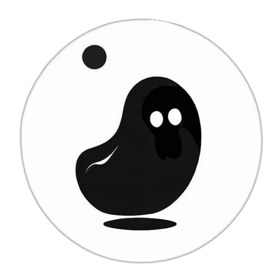

# Yugen - A Functional Language (Work in Progress)

Yugen is an exciting new functional programming language that is currently in the early stages of development. It is designed to provide a powerful and expressive toolset for functional programming enthusiasts. This README provides an overview of the project and its current status.

## Features (Planned)

- **Functional Paradigm**: Yugen is built around functional programming principles, allowing developers to write clean and concise code.

- **Immutable Data**: Immutable data structures are at the core of Yugen, promoting safety and predictability in code.

- **Pattern Matching**: Yugen will support pattern matching, making it easier to work with complex data structures.

- **Strong Static Typing**: The language will have a strong static type system to catch errors at compile time.

- **Haskell Inspired**: Yugen takes inspiration from Haskell, incorporating some of its best features.

## Getting Started

As Yugen is currently in development, there are no stable releases yet. However, you can clone the repository to explore the code and contribute to its development.

## Development

Following [a tutorial](https://smunix.github.io/dev.stephendiehl.com/fun/index-2.html) by Stephen Diehl.